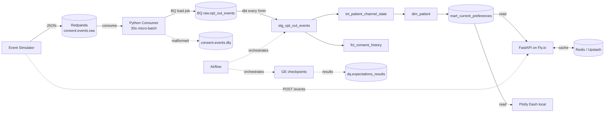

# Patient Consent Ledger

> Near-real-time multi-channel patient consent reconciliation across three retailers, with identity resolution, SCD2 history, and a cached read API.

**Status:** Phase 0 in progress · **Target completion:** ~8–10 weeks

## What this is

Patients in pharmacy networks can opt in or out of marketing communications across multiple channels (SMS, mailed letter, in-home pharmacist visit) at multiple retailers. State changes arrive asynchronously, can collide across retailers (same person, different patient_id), and sometimes arrive late. This project ingests those events, reconciles them to a single source of truth per patient, and serves the current consent state via a cached HTTP API.

It is a portfolio project — the patients, retailers, and events are simulated.

## Architecture



Full rationale in [ADR-001](docs/adr/001-architecture.md).

## Tech stack

| Layer | Tool |
|---|---|
| Event simulation | Python, pydantic |
| Streaming bus | Redpanda (Kafka API) |
| Ingestion | Python consumer (confluent-kafka) → BQ load jobs every 30s |
| Warehouse | BigQuery Sandbox |
| Transformation | dbt Core (BQ adapter); incremental + SCD2; deterministic identity resolution |
| Orchestration | Apache Airflow (local Docker) |
| Data quality | Great Expectations Core 1.x |
| Serving | FastAPI + X-API-Key auth |
| Cache | Redis (local), Upstash (prod) |
| Dashboard | Plotly Dash (local only) |
| Deploy | Fly.io (FastAPI), Docker Compose (everything local) |
| CI | GitHub Actions — lint, pytest, dbt compile on PR |

## Quickstart

**Prerequisites**
- Docker Desktop (with `docker compose`)
- GNU Make (Windows: install via `choco install make` or run inside Git Bash / WSL)
- A Google Cloud account (no billing required — BigQuery Sandbox is free)

**One-time setup**

1. Create a BigQuery Sandbox service account:
   - GCP console → IAM & Admin → Service Accounts → **Create**
   - Grant role `BigQuery Admin` (scoped to your sandbox project)
   - Keys → Add Key → JSON → download
   - Save the JSON to `secrets/bq-sa.json` (the `secrets/` directory is gitignored)

2. Configure environment:
   ```bash
   cp .env.example .env
   # edit .env and set GCP_PROJECT_ID + API_KEY + AIRFLOW_SECRET_KEY
   ```

3. Boot and seed:
   ```bash
   make up         # boots redpanda, airflow, redis, api, dash, consumer
   make seed-bq    # creates the raw/staging/marts/dq datasets in BQ
   ```

4. Verify everything is green:
   - Redpanda Console → http://localhost:8080
   - Airflow UI → http://localhost:8081  (admin / admin)
   - FastAPI docs → http://localhost:8000/docs
   - Dash → http://localhost:8050

**Day-to-day**
```bash
make ps         # container status
make logs       # tail all logs
make down       # stop everything (volumes preserved)
make clean      # stop and DESTROY local data
make simulate   # start the event simulator   (Phase 1)
```

## Project structure

```
patient-consent-ledger/
├── apps/
│   ├── simulator/          # Phase 1: event generator -> Redpanda
│   ├── consumer/           # Phase 2: Redpanda -> BQ load jobs
│   ├── api/                # Phase 7: FastAPI preference service
│   └── dash/               # Phase 8: Plotly Dash UI
├── airflow/
│   ├── dags/               # Phase 5: dbt + GE orchestration
│   ├── plugins/
│   └── logs/               # bind volume (gitignored)
├── dbt/                    # Phase 3+4: staging, intermediate, marts
├── gx/                     # Phase 6: Great Expectations suites & checkpoints
├── infra/
│   ├── scripts/            # seed_bq.py and other one-shots
│   └── bq/                 # BQ schema DDL (if needed outside dbt)
├── tests/                  # cross-cutting pytest
├── docs/adr/               # architecture decision records
├── secrets/                # bq-sa.json lives here (gitignored)
├── docker-compose.yml
├── Makefile
├── pyproject.toml
├── .pre-commit-config.yaml
└── .env.example
```

## Roadmap

- [ ] Phase 0 — Foundation & accounts
- [ ] Phase 1 — Event simulator
- [ ] Phase 2 — Kafka → BQ ingestion
- [ ] Phase 3 — Staging dbt models
- [ ] Phase 4 — Business logic + identity resolution
- [ ] Phase 5 — Airflow orchestration
- [ ] Phase 6 — Data quality (Great Expectations)
- [ ] Phase 7 — FastAPI + Redis
- [ ] Phase 8 — Plotly Dash dashboard
- [ ] Phase 9 — Cloud deploy (Fly.io + Upstash)
- [ ] Phase 10 — Polish + resume framing

## Architecture decisions

- [ADR-001 — Architecture overview](docs/adr/001-architecture.md)
- [ADR-002 — Local-first stack, no GCP billing](docs/adr/002-path-b-rationale.md)

Further ADRs are added per phase (identity resolution, dedupe strategy, SCD2 design, cache invalidation, etc.).

## License

MIT
